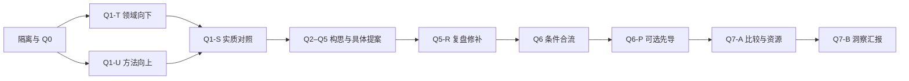

<p align="center">
  
</p>

<h1 align="center">Research Discovery Workflow</h1>

<p align="center">
  <strong>把领域理解，转化为具体研究提案与有判别力的规划。</strong><br>
  一个通用的科研发现与 planning Skill，不限定领域，不预设 Agent 或 LLM。
</p>

<p align="center">
  <a href="README.md">中文</a> · <a href="README_EN.md">English</a><br>
  <a href="https://github.com/heisenberg0020/research-discovery-workflow/releases/latest"></a>
  <a href="https://github.com/heisenberg0020/research-discovery-workflow/actions/workflows/ci.yml"></a>
  
  <a href="LICENSE"></a>
</p>

<p align="center">
  <a href="#quick-start">快速开始</a> ·
  <a href="#workflow">研究链</a> ·
  <a href="#choose">按需求选择</a> ·
  <a href="#examples">示例</a> ·
  <a href="#validation">验证范围</a> ·
  <a href="#docs">文档</a>
</p>

---

不是再列一批“值得进一步研究”的题名，而是回答：

> 已有答案是什么？我们具体还想发现或改善什么？哪一个有意义的区别，会让这项研究真正有内容？

理解领域关心什么，也理解已有方法实际怎么工作；允许有依据的大胆构思，再把机制、强替代、比较和资源写具体。发现近邻不等于问题已经充分解决，缺少类似论文也不等于选题有价值。

**科研 Workflow 已冻结在 v1.0.0。** 仓库 v1.3.0 只完善展示、安装、示例、实测证据、检查和发行；Skill、引用指令、启动提示词及准备器保持字节不变。[冻结范围与核对 →](docs/FROZEN_WORKFLOW.md)

<a id="quick-start"></a>

## 快速开始

需要能加载本地 Skill 的 Agent 客户端；可选辅助工具只需 **Python 3.10+ 标准库**。不内置模型、检索 API 或实验执行器。

### 1 / 获取并预览安装

```sh
git clone https://github.com/heisenberg0020/research-discovery-workflow.git
cd research-discovery-workflow
RDW_PYTHON=python3
"$RDW_PYTHON" -c 'import sys; print(sys.executable, sys.version); raise SystemExit(0 if sys.version_info >= (3, 10) else "Python 3.10+ required")'
```

以上是 macOS/Linux 等 POSIX 终端写法。`python3` 只是候选命令；若不存在或版本不足，把 `RDW_PYTHON` 改为 `python` 或已安装的 Python 3.10+ 可执行路径，并重新检查。**版本检查成功后**，在同一终端继续：

```sh
"$RDW_PYTHON" scripts/install.py --dry-run
"$RDW_PYTHON" scripts/install.py
```

安装器默认使用 `CODEX_HOME/skills`，未设置时使用 `$HOME/.codex/skills`；同名目标已存在就停止，不覆盖个人改动。预览不会创建文件。安装后按[只检查加载、不启动研究](docs/compatibility.md#loading-check)核对；自定义安装、更新、Windows 命令说明与 ZIP 解压前校验见[安装说明](docs/installation.md)。

### 2 / 给一份中性兴趣文档

复制[中性 brief 示例](examples/neutral-brief.md)并填写自己的领域、关注问题、可协商边界和资源事实。示例只是输入辅助，不是必须新增的科研模板。

在新的、非 fork 对话中提供这份实际文档，并指定干净工作根。首次使用可以直接说：

```text
使用 $research-discovery-workflow。
研究兴趣与可协商边界以我附上的中性文档为准，请在指定的新工作根开展完整探索与 planning。

先落实并说明五步环境隔离，执行 Q0–Q5，再保存原独立快照并完成 Q5-R 复盘与纸面修补。
本轮没有旧成果，Q6 标 not_applicable。只规划，不执行实验或额外付费调用。
先完成 Q7-A 的具体比较方案与真实资源估算，再进行 Q7-B。
最后在对话里详细讲清领域洞察、候选怎样形成、具体机制、剩余价值、强替代及下一步判断。
```

完整第一轮、第二轮和延迟交接提示词见[原版启动文档](docs/STARTER_PROMPTS.zh-CN.md)。安装不创建新对话、不清除记忆；宿主隔离能力有缺口时必须如实说明。

<a id="workflow"></a>

## 研究链：先理解与构造，再修订与决定



| 核心环节 | 为什么保留 |
| --- | --- |
| 两条发现路线 | 领域向下看重要目标与现实条件，方法向上理解工作原理；首轮分开保存，不强迫只留交集 |
| 具体机制与近邻判断 | 讲清关系、操作和信息时序；把相关性、竞争力、是否充分解决分别判断 |
| Q5-R 必做复盘 | 保留原快照，检查科学内容并修补；不能只补一句风险说明 |
| Q6 条件合流 | 首次无旧成果可跳过；有旧材料时到 Q5-R 后再按范围交接 |
| Q7-A → Q7-B | 先有可执行比较与资源估算，再开展全面、详细、自包含的洞察汇报 |

Q7-A 逐方向回答四件事：**近邻已回答到哪里；两种竞争解释与区分观察；真实资源、划分与估算；不同结果改变什么决定。** 资源或机制尚未确定时可以汇报局部进展，不能以完成子问题冒称整体就绪。计划就绪不等于已经执行或验证。

完整阶段与宿主职责见[架构导览](docs/architecture.md)；执行时使用[冻结 Skill 入口](skills/research-discovery-workflow/SKILL.md)。

<a id="choose"></a>

## 按需求选择

| 你现在想做什么 | 从哪里开始 | 得到什么 |
| --- | --- | --- |
| 第一次找研究问题 | 中性 brief + 第一轮提示词 | 当前答案、具体提案、比较与条件规划；无需旧成果 |
| 从已有成果重新探索 | 先只给中性兴趣，旧成果留到 Q6 | 保留独立版，并得到有依据的对照与合流 |
| 做两轮后再选题 | 第二轮新上下文仍只用同一 brief；到 Q5-R 后交接第一轮 | 最终合流版，可保留第一轮更好的构思 |
| 仅准备工作目录 | 冻结的 `prepare_run.py` | 空的 `prepared-not-started` 工作根，不启动研究 |
| 维护或贡献仓库 | 仓库检查 + [贡献指南](CONTRIBUTING.md) | 文档、冻结范围与辅助工具的实际验证 |

两轮是推荐用法，不是强制。第二轮不天然更好，重复引用同一论文不算独立科学证据。先导可以只提出或跳过；实际实验仍按具体授权开展。

<a id="examples"></a>

## 示例与预期成果

[中性兴趣文档](examples/neutral-brief.md)说明如何给输入；[示例导览](examples/README.md)包含短片段与完整教学案例。

[截止前信息价值：完整注释案例](examples/deadline-information/README.md)展示：怎样从兴趣形成具体问题，来源怎样改变理解，Q5-R 实际修正了哪项关系，以及怎样形成比较方案和洞察式报告。[双轮延迟交接演示](examples/deadline-information/two-pass.md)说明何时、以什么范围引入第一轮，以及为什么第二轮不必胜出。

完整案例使用可核对的公开来源，但其探索轨迹和双轮版本是**原创教学构造，不是两次真实独立运行的记录**；不包含实验成绩，不证明新颖性或 Workflow 有效性，也不是必须照抄的题目或模板。

准备器预留原独立版、修订版和最终版目录。报告应保留定义机制，并解释已有答案、具体剩余机会、严肃替代和判别路线；可以使用少数连贯文档，不需要为了每个标题单独建文件。**文件供核查，不能替代对话中的洞察式讲解。**

<a id="validation"></a>

## 验证与边界

```sh
"$RDW_PYTHON" scripts/check_repo.py
"$RDW_PYTHON" -m unittest discover -s tests -v
```

检查覆盖冻结文件摘要、文档/资产链接、目录准备、临时安装和发行包。GitHub CI 的实际结果见上方徽章与 [Actions](https://github.com/heisenberg0020/research-discovery-workflow/actions)。

若换了终端，先重新选择并检查 `RDW_PYTHON`，见快速开始。

首版做过少量虚构材料行为试走，发现过范围与状态判断问题，并记录了修正及未覆盖范围。[验证记录 →](docs/VALIDATION.md)

新增[实际 Codex CLI 读取与行为回执](docs/validation-runs/2026-10-06-codex-cli/README.md)：公开六次单次调用的脱敏输出、修订产物与用量。它们支持所测的小场景行为，但不认证内部自动注册、子代理独立隔离或现实科研质量；GUI 与其他客户端未测。实测工具需主动执行，会消耗账户额度，普通检查不会运行它们。

**这些测试不证明选题质量、新颖性、科研成功率、两轮优越性或宿主隔离效果。** 七项上游能力是可选接入，没有捆绑其脚本或服务；其他客户端的加载与权限按[实际兼容范围](docs/compatibility.md)说明。

<a id="docs"></a>

## 文档导航

| 使用者 | 维护者与深入理解 |
| --- | --- |
| [安装、启动与更新](docs/installation.md) | [架构与职责](docs/architecture.md) |
| [第一轮、第二轮与交接提示词](docs/STARTER_PROMPTS.zh-CN.md) | [Workflow 冻结](docs/FROZEN_WORKFLOW.md) |
| [原始 English quick start](docs/QUICKSTART.en.md) | [验证证据与限制](docs/VALIDATION.md) |
| [中性输入与示例](examples/README.md) | [来源与许可](docs/PROVENANCE.md) |
| [完整案例与双轮交接](examples/deadline-information/README.md) | [English installation](docs/installation.en.md) · [English compatibility](docs/compatibility.en.md) |
| [兼容与常见问题](docs/compatibility.md) | [贡献指南](CONTRIBUTING.md) · [版本记录](CHANGELOG.md) |

MIT 许可证。感谢 [lingzhi227/agent-research-skills](https://github.com/lingzhi227/agent-research-skills) 对七项 Phase 0 能力分类的启发；本仓库未复制其 Skill 文本与脚本。首页组织参考两个公开项目，图示与本仓库文稿原创，详情见[来源说明](docs/PROVENANCE.md)。私人科研材料不随仓库发布。

<p align="center">
  <strong>Understand deeply. Propose concretely. Explain clearly.</strong><br><br>
  <a href="https://github.com/heisenberg0020/research-discovery-workflow/releases/latest">下载发行包</a> ·
  <a href="https://github.com/heisenberg0020/research-discovery-workflow/issues">反馈问题</a> ·
  <a href="#quick-start">开始使用 ↑</a>
</p>
