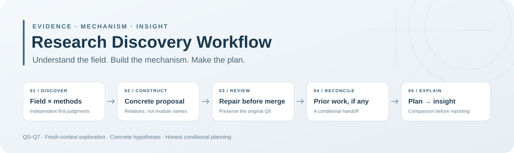
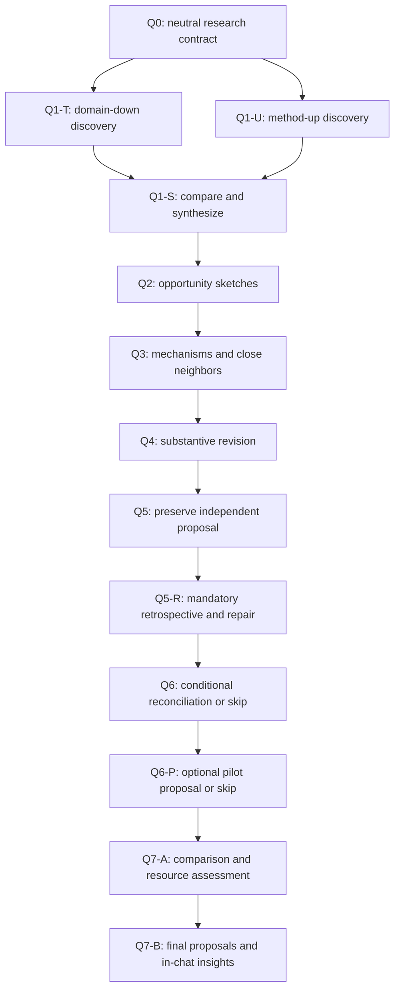

# Research Discovery Workflow

<p align="center">
  
</p>

<p align="center">
  <strong>Turn understanding of a field into concrete proposals and plans that distinguish competing answers.</strong>
</p>

<p align="center">
  <a href="README.md">中文</a> · <a href="README_EN.md">English</a><br />
  <a href="https://github.com/heisenberg0020/research-discovery-workflow/releases/latest"></a>
  <a href="https://github.com/heisenberg0020/research-discovery-workflow/actions/workflows/ci.yml"></a>
  
  <a href="LICENSE"></a>
</p>

<p align="center">
  <a href="#quick-start">Quick start</a> ·
  <a href="#workflow">Workflow</a> ·
  <a href="#examples">Examples</a> ·
  <a href="#validation">Validation</a> ·
  <a href="#docs">Docs</a>
</p>

This portable Skill supports open-ended topic selection, literature-to-idea synthesis, explanations of phenomena, and method proposals across research fields. It develops the research object, its mechanism, the nearest existing answers, and a comparison that could change a research decision.

It is a planning Skill, not an experiment execution harness. Its default work is literature, theory, and static code understanding. Planning does not authorize implementation, training, or experiments.

Repository **v1.3.0** adds actual client and fictional behavior evidence alongside onboarding and public teaching examples. The scientific workflow remains the byte-frozen **v1.0.0** workflow; see the [freeze boundary](docs/FROZEN_WORKFLOW.md) and [changelog](CHANGELOG.md). Earlier releases remain available.

## Quick start

Use Python 3.10 or newer. The package helpers use the Python standard library.

```bash
git clone https://github.com/heisenberg0020/research-discovery-workflow.git
cd research-discovery-workflow
RDW_PYTHON=python3
"$RDW_PYTHON" -c 'import sys; print(sys.executable, sys.version); raise SystemExit(0 if sys.version_info >= (3, 10) else "Python 3.10+ required")'
```

These are POSIX-shell commands, suitable for macOS/Linux. `python3` is a candidate, not a guaranteed version. If it is missing or older, select `python` or the full path of an installed Python 3.10+ executable, then repeat the check. **Only after it succeeds**, continue in the same terminal:

```sh
"$RDW_PYTHON" scripts/install.py --dry-run
"$RDW_PYTHON" scripts/install.py
```

The installer refuses to overwrite an existing Skill. Its default destination is `$CODEX_HOME/skills` when `CODEX_HOME` is configured, otherwise `~/.codex/skills`. Read [English installation and updates](docs/installation.en.md) for destination choices, Windows command notes, and release checksums before extraction. Installing files does not guarantee that a host refreshes its Skill list; use the optional [loading-only check](docs/compatibility.en.md#loading-check), which starts no research.

Copy [the English neutral brief](examples/neutral-brief.en.md) to a personal file and edit it with your actual topic, research goal, evidence scope, constraints, and resources. Keep previous proposals, rankings, architectures, and results out of this first-pass input.

Start a **fresh, non-forked chat** with that brief and a new, scoped output workspace. Invoke the installed Skill using this planning-only request, replacing both paths:

```text
Use $research-discovery-workflow for research discovery and proposal planning.

Neutral brief: /absolute/path/to/my-neutral-brief.md
New output workspace: /absolute/path/to/new-discovery-workspace

Follow the frozen Q0–Q7 workflow. Keep Q1-T domain-down and Q1-U
method-up first judgments separate before Q1-S synthesis. Develop
concrete mechanisms and preserve the original Q5 proposal unchanged.

Complete mandatory Q5-R retrospective and separate repairs before
reading previous research results. Q6 is conditional on an authorized
handoff; with no prior material, mark it not_applicable. Propose or
skip optional Q6-P without running a pilot.

Complete Q7-A's four-question comparison design and resource assessment
before Q7-B. Finish with a substantive in-chat insight report as well
as saved planning artifacts, stating actual readiness and conditions.

Describe the actual context, memory, and file-access isolation limits.
Do not implement the proposal, run experiments, train models, or resume
previous experiments. Stop after the planning deliverable.
```

A prepared directory does not create a fresh conversation, clear memory, or restrict file access. Use the [English compatibility guide](docs/compatibility.en.md) to understand what your host supports, including an explicit-read fallback. Repository helpers and onboarding documents are optional wrappers around the frozen workflow.

## Workflow

The two discovery routes begin with the same neutral contract. Each saves its first judgment before exchanging candidate judgments. Their synthesis feeds mechanism construction and revision.



Q5-R preserves the independent proposal and saves repairs separately. Q6 reconciles only authorized previous material after that review. First use can mark Q6 `not_applicable`; an explicitly skipped comparison can use `skipped`. A required but missing handoff remains `pending_handoff`.

Before the comprehensive Q7-B report, Q7-A answers four questions for each retained developed direction:

1. Where does the nearest work's answer actually stop?
2. What exact difference do we still want to answer?
3. Which real resources can answer it?
4. What decision would the result change?

Q7-A states the plan's actual readiness: executable within specified conditions, conditional, or incomplete. An unresolved main mechanism or resource gap is partial progress, not a completed Q7-B report. Filled headings and saved files do not establish completion or research quality.

For **two passes**, complete pass 1 through Q7. Start pass 2 in a fresh context with the same neutral brief, withholding pass-1 results through pass-2 Q5-R. Only then supply the authorized pass-1 handoff for Q6. An informed revisit must be described honestly; repeated sources do not provide independent confirmation.

## Examples

Read the [complete annotated case in English](examples/deadline-information/README_EN.md): public source understanding, concrete construction, separate Q5 original and repairs, formal comparisons, and an insight-rich final explanation. Its [two-pass handoff demonstration](examples/deadline-information/two-pass.md) shows the authorized packet and its delayed delivery, with English notes.

This is an **authored educational reconstruction, not a record of two actual independent runs**. Sources are real; candidate versions and the discovery storyline are teaching constructs. It includes no empirical performance, novelty claim, or evidence that the Workflow improves research quality. The original [short illustrative fragment](examples/README.md) remains available in Chinese.

A run normally leaves a lightweight `RUN.md` index, independent proposals, separate retrospective and repair records, applicable reconciliation, comparison plans, and a final explanation. Actual scientific content and unresolved dependencies matter more than a file inventory.

Host support and the distinction between preparation and isolation are documented in [English compatibility](docs/compatibility.en.md). Optional integrations are described by the Skill; they are not required to use the workflow.

## Validation

From the repository root:

```bash
"$RDW_PYTHON" scripts/check_repo.py
"$RDW_PYTHON" -m unittest discover -s tests -v
```

These checks cover public repository contracts and behavior represented by fictional fixtures. They require no experiments, external model calls, or live topic research. Passing them does not prove proposal novelty, scientific validity, or experiment success. See [validation scope](docs/VALIDATION.md) for the checks and their limits.

If this is a new terminal, select and check `RDW_PYTHON` again before running these commands.

The [actual Codex CLI receipt](docs/validation-runs/2026-10-06-codex-cli/README.md#english-summary) retains six one-attempt fictional runs, sanitized output/artifacts and reported usage. These demonstrate the listed local reading and behavior paths, not internal auto-registration, child isolation or research quality. GUI and other hosts remain untested. Live capture is opt-in and consumes account quota; unit tests and CI never launch it.

## Docs

| Read this | For |
| --- | --- |
| [English installation](docs/installation.en.md) | Install, inspect destinations, and update without overwriting |
| [Architecture](docs/architecture.md) | Repository layout and the roles of Skill, helpers, and documentation |
| [English compatibility](docs/compatibility.en.md) | Host capabilities, fresh-context limits, and optional integrations |
| [Annotated English case](examples/deadline-information/README_EN.md) | Understand concrete proposals, repairs and delayed handoff |
| [English neutral brief](examples/neutral-brief.en.md) | Editable optional starting input |
| [Frozen workflow](docs/FROZEN_WORKFLOW.md) | The scientific v1.0.0 boundary retained by repository v1.3.0 |
| [English quickstart](docs/QUICKSTART.en.md) | The original workflow usage guide |
| [中文启动提示](docs/STARTER_PROMPTS.zh-CN.md) | Chinese starter prompts |
| [Validation](docs/VALIDATION.md) | Package checks, fictional fixtures, and claims they cannot establish |
| [Provenance](docs/PROVENANCE.md) | Origins and attribution of the generalized workflow |
| [Contributing](CONTRIBUTING.md) | Public feedback and repository contributions |
| [Changelog](CHANGELOG.md) | Distribution changes and retained releases |

The package is distributed under the [MIT license](LICENSE). The installer includes the repository license in its installed payload outside the frozen scientific instructions.
