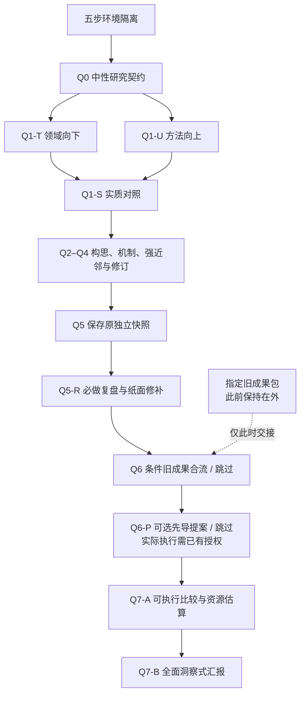

# 架构：指导研究，不替代执行宿主

本页是冻结 Workflow 的导览，不是另一套执行指令。完整权威入口是 [SKILL.md](../skills/research-discovery-workflow/SKILL.md)；[冻结范围](FROZEN_WORKFLOW.md)保持不变。

## 三层职责

| 层 | 做什么 | 不做什么 |
| --- | --- | --- |
| Workflow Skill | 指导理解领域、展开机制、复盘修订、条件合流与洞察汇报 | 不提供模型、不自动创建对话、不执行访问控制 |
| 宿主 Agent / 客户端 | 读取指令、推理、使用实际可用的检索与文件工具；支持时创建新上下文 | 宿主能力不会因安装 Skill 自动增加 |
| 仓库辅助工具 | 可选安装、准备空目录、检查分发文件和打包版本 | 不启动调研、训练、先导实验或额外付费调用 |

## 原有研究链



T/U 首轮判断分别保存；若实际已经互相暴露，应如实说明，不能把两个章节当作两条独立路线。Q1-S 不只保留交集，可信的单线机会也可以继续。

Q5-R 先检查当前独立成果，再做有依据的修补。Q6 根据有无指定旧材料执行或跳过；没有旧成果不妨碍首次使用。Q7-A 四问先形成具体比较方案，Q7-B 再解释领域洞察、候选来源、具体机制、价值与下一步。

## 文件与实际使用

```text
research-discovery-workflow/
├── README.md / README_EN.md       使用入口
├── docs/                         导览、冻结记录、使用与验证说明
├── examples/                     双语中性 brief、完整教学案例与规划片段
├── scripts/                      安装、仓库检查、发行工具
├── skills/research-discovery-workflow/  冻结的可安装 Skill
│   ├── SKILL.md
│   ├── agents/openai.yaml
│   ├── references/
│   └── scripts/prepare_run.py
└── tests/                        文件与辅助工具检查
```

安装只复制 Skill 包，并附带根目录 MIT 许可证；不把仓库示例、旧候选或测试材料装入 Agent 指令。准备器只复制中性 brief 和冻结 Skill，创建 `prepared-not-started` 工作根。

参考中的长期执行器、实验状态库、训练课程和证据账本不属于本仓库。科研内容与判断仍由 Agent 按冻结 Workflow 开展；文件检查通过不替代科学判断。

完整教学案例见[截止时刻的信息价值](../examples/deadline-information/README.md)，其中分开保存原提案、纸面修订、正式比较方案与洞察报告；[双轮交接演示](../examples/deadline-information/two-pass.md)解释旧成果何时进入。它们是作者编写的示范，不是两轮实际独立运行记录，也不构成新增流程要求。开始自己的独立探索时只提供自己的中性 brief，不把案例答案作为输入。
